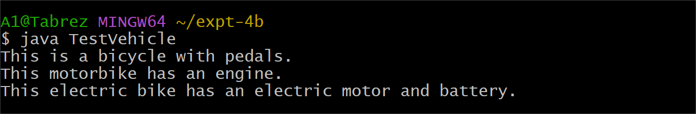

# Expt-4
# expt-4a
```java
class Person {
    String name;
    int age;

    Person(String name, int age) {
        this.name = name;
        this.age = age;
    }

    void displayPersonDetails() {
        System.out.println("Name: " + name);
        System.out.println("Age: " + age);
    }
}
class Employee extends Person {
    double annualSalary;
    int yearOfJoining;
    String nationalInsuranceNumber;

    Employee(String name, int age, double annualSalary, int yearOfJoining, String nationalInsuranceNumber) {
        super(name, age);
        this.annualSalary = annualSalary;
        this.yearOfJoining = yearOfJoining;
        this.nationalInsuranceNumber = nationalInsuranceNumber;
    }

    void displayEmployeeDetails() {
        displayPersonDetails();
        System.out.println("Annual Salary: " + annualSalary);
        System.out.println("Year Of Joining: " + yearOfJoining);
        System.out.println("National Insurance Number: " + nationalInsuranceNumber);
    }
}
public class TestEmployee {
    public static void main(String[] args) {

        Employee emp1 = new Employee(
                "Ramesh",
                30,
                550000.0,
                2018,
                "NI12345"
        );

        emp1.displayEmployeeDetails();
    }
}


```
output :


# expt-4b
```java
class Bicycle {
    String pedalType;

    void showBicycleInfo() {
        System.out.println("This is a bicycle with pedals.");
    }
}
class Motorbike extends Bicycle {
    int engineCapacity;

    void showMotorbikeInfo() {
        System.out.println("This motorbike has an engine.");
    }
}
class ElectricBike extends Motorbike {
    int batteryCapacity;

    void showElectricBikeInfo() {
        System.out.println("This electric bike has an electric motor and battery.");
    }
}
public class TestVehicle {
    public static void main(String[] args) {

        ElectricBike eBike = new ElectricBike();

        eBike.pedalType = "Manual Pedals";
        eBike.engineCapacity = 250;
        eBike.batteryCapacity = 500;

        eBike.showBicycleInfo();
        eBike.showMotorbikeInfo();
        eBike.showElectricBikeInfo();
    }
}

```
output :


# expt-4c
```java
abstract class Figure {
    double dim1;
    double dim2;

    Figure(double dim1, double dim2) {
        this.dim1 = dim1;
        this.dim2 = dim2;
    }

    abstract double area();
}

class Rectangle extends Figure {

    Rectangle(double length, double breadth) {
        super(length, breadth);
    }

    double area() {
        return dim1 * dim2;
    }
}

class Triangle extends Figure {

    Triangle(double base, double height) {
        super(base, height);
    }

    double area() {
        return 0.5 * dim1 * dim2;
    }
}

public class TestFigure {
    public static void main(String[] args) {

        Figure f1 = new Rectangle(10, 5);
        System.out.println("Area of Rectangle = " + f1.area());

        Figure f2 = new Triangle(6, 4);
        System.out.println("Area of Triangle = " + f2.area());
    }
}

```

output :

